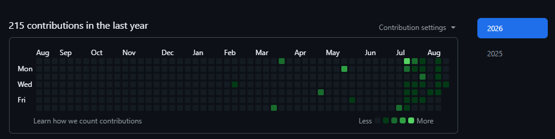
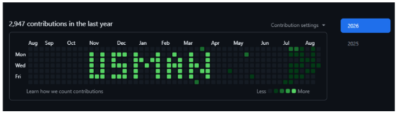

<h1 align="center">🎨 My GitHub Contribution Canvas — "USMAN"</h1>

<p align="center">
  <b>A personal algorithmic project created by Muhammad Usman to paint my name across my GitHub profile contribution grid using 2D coordinate matrix math and Git commit automation.</b>
</p>

<p align="center">
  <a href="https://github.com/usaaman"></a>
  <a href="https://github.com/usaaman/pixel-contributions"></a>
  <a href="https://github.com/usaaman/pixel-contributions"></a>
</p>

---

## 🌟 About This Personal Project

Welcome! This is my personal GitHub profile art project.

I created this script to transform my own GitHub contribution graph into a custom canvas. Using **2D coordinate matrix mathematics**, **custom pixel letter mapping**, and **Git commit timestamp manipulation**, I algorithmically painted my name — **USMAN** — directly onto the 52-week × 7-row GitHub profile grid.

---

## 📸 Visual Transformation (Before & After)

### 📉 Before
*My standard, empty GitHub contribution graph:*

<p align="center">
  
</p>

---

### 🎨 After
*My transformed GitHub contribution graph spelling **USMAN** in Level-4 bright green pixels:*

<p align="center">
  
</p>

---

## 📐 How I Mathematically Built "USMAN"

The GitHub contribution graph is a **7-row × 52-column matrix** representing days of the week (Sunday = 0 to Saturday = 6).

I mathematically defined the letter matrices for **U-S-M-A-N** in `contribute.py`:

1. **Pixel Coordinate Mapping**:
   Each letter is mapped as a set of relative $(w, d)$ coordinates:
   ```python
   LETTER_MAP = {
       'U': [(0, 1), (0, 2), (0, 3), (0, 4), (0, 5), (1, 5), (2, 1), (2, 2), (2, 3), (2, 4), (2, 5)],
       'S': [(0, 1), (0, 2), (0, 3), (0, 5), (1, 1), (1, 3), (1, 5), (2, 1), (2, 3), (2, 4), (2, 5)],
       'M': [(0, 1), (0, 2), (0, 3), (0, 4), (0, 5), (1, 2), (2, 3), (3, 2), (4, 1), (4, 2), (4, 3), (4, 4), (4, 5)],
       'A': [(0, 2), (0, 3), (0, 4), (0, 5), (1, 1), (1, 3), (2, 2), (2, 3), (2, 4), (2, 5)],
       'N': [(0, 1), (0, 2), (0, 3), (0, 4), (0, 5), (1, 3), (2, 4), (3, 1), (3, 2), (3, 3), (3, 4), (3, 5)]
   }
   ```

2. **Date Delta Calculation**:
   $$\text{Commit Date} = \text{First Sunday of Year} + (w \text{ weeks}) + (d \text{ days})$$

3. **Color Density (35 Commits/Pixel)**:
   To ensure every pixel shines in full Level-4 bright green, the script creates 35 commits per pixel spaced 2 minutes apart with clean ISO-8601 timestamps (`YYYY-MM-DDTHH:MM:SS`).

---

## 💡 Want To Draw Your Own Name?

> **Note for Visitors:**  
> Since this code is configured specifically for my name (**USMAN**), running it directly as-is will draw my name on your profile!  
> 
> **How to adapt it for your name:**  
> If you'd like to draw your own name on your GitHub profile:
> 1. Copy `contribute.py` from this repository.
> 2. Paste it into ChatGPT, Claude, or any AI coding tool.
> 3. Simply ask: *"Replace the `LETTER_MAP` dictionary in this Python script with pixel matrix coordinates for my name [YOUR NAME]."*
> 4. Run the script with your own GitHub repository URL!

---

## 👨‍💻 Author

**Muhammad Usman**  
GitHub: [@usaaman](https://github.com/usaaman)

---
*Built with Python, Math & Personal Creativity.*
